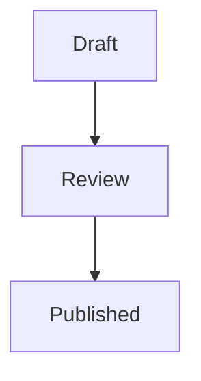

# Working in Acta

## Home

Home opens with a greeting and one line on what is waiting for you: cards
overdue, due today, mentions you have not read, and cards of yours that hold
somebody else up.

**Next up** is the list of what to pick up next, across every space. It holds
your open cards, plus any card due within a week that nobody is on in a space
you work in, ranked by what makes each one pressing. Every card says why it is
there, two reasons at a glance and all of them behind the (i):

| Reason                               | Counts for                                                         |
| ------------------------------------ | ------------------------------------------------------------------ |
| Overdue                              | the most, more for every day late                                  |
| Due today, tomorrow, within the week | less the further away                                              |
| Urgent, High, Medium priority        | a card's [priority](#priority)                                     |
| A mention waiting on you             | an unread mention of you on the card                               |
| Blocks another card                  | other people's open cards it holds up, more if one of them is late |
| A goal off track or at risk          | the [goal](/users/goals) it serves is in trouble                   |
| In progress, In review               | work already started finishes first                                |
| Untouched for a week                 | in progress but nobody has moved it                                |
| Nobody on it                         | a dated card with no assignee, slightly lower                      |

A card that waits on another card is not ranked: it sits under **Waiting on
other cards**, saying what it waits on. The list follows changes as they
happen.

Below it, Home has more panels, each with an (i) that says what it shows:

- **Goals**: how your [goals](/users/goals#home) stand, and the ones that
  need a look.
- **Falling behind**: in the spaces you work in, whoever holds them, cards
  past their due date, cards in progress that nobody has moved for a week, and
  goals still in flight past their target date.
- **Needs your attention**: what colleagues did this week on cards you hold,
  created or have commented on, one line per card. Your own changes and
  mentions (which Next up ranks) are left out.
- **Document updates**: pages somebody else changed in the last two weeks that
  you own, have commented on or are named in, with the number of open comment
  threads on pages you own.
- **Where you left off** (off by default): the cards you changed last.
- **Spaces**: every space, favourites first.

### Make Home your own

**Customize** at the top of Home opens a list of the panels beside it. Drag
them into the order you want (or pick one up with Space and move it with the
arrow keys), switch off the ones you do not need, and make a panel wide to
give it the whole row. Home changes as you go, and the layout is saved on your
account, so it is the same in every browser. Next up can move but not be
switched off. **Reset to the default layout** puts everything back. A panel
added to Acta later appears in its default place, even on a Home you have
customised.

## Priority

A card can be **Urgent**, **High**, **Medium** or **Low**, or have no priority,
which is most cards. Set it from the card's Priority field. Urgent and High
show on the card on a board, the Table view has a sortable Priority column, and
[Next up](#home) ranks by it.

## Views

A space can be read five ways. They are the same cards, not five feature sets.


**Board** is the default: lists as columns, cards in them, drag to move. Column
headers stay put as you scroll. **Swimlanes** split the board into horizontal
bands by assignee, label or status, which is how you see that one person holds
nine of the twelve in-progress cards.

**Table** is the one to use when you want to compare rather than move: sortable
columns, every field visible at once.

**Calendar** places cards with due dates. **Timeline** draws them as bars.
Cards without dates do not appear in either, which is most of them in most
projects, and is why the fifth view exists.


**Sequence** draws the plan as an order rather than as dates. It reads top to
bottom in numbered steps: everything in step 1 can start now, everything in
step 2 waits on step 1, and so on. The **critical path** is highlighted: the
longest chain by size, the one where a slip slips the whole finish. _Critical
path only_ filters to it.

Sequence is computed from dependencies you declare, not guessed. If nothing
declares a dependency, everything is in step 1, which is correct and not very
useful.

## Cards

### On a board

Every card on a board has the same six rows, in the same order, so the same
fact is always in the same place:

1. **Header**: the card's key, the card it is part of, and on the right
   whether it is blocked (and by what), done, and its size.
2. **Title**, up to three lines.
3. **Summary**: the first line of the description.
4. **Goal**: the [goal](/users/goals) it serves, with a dot for how that goal
   stands. A card serving more than one shows the first and "+1". Click it to
   open the goal.
5. **Labels**.
6. **Footer**: checklist, comments, attachments and parts, always all four and
   in that order, dimmed at zero and green when complete. On the right, the due
   date (amber for today and tomorrow, red once late, green once done) and up to
   three people, then "+N".

A row with nothing in it keeps its place and says so: "No description",
"No goal", "No labels", an empty calendar, an empty face. So an empty card is
the same shape as a full one, and only a long title makes a card taller.

Those empty slots are buttons. Click "No goal", "No labels", the empty
calendar, the empty face or the dashed size to set it right there, without
opening the card.

### Sorting a board

The sort control in the board's bar orders the cards inside every column:
**Manual order** (the order you drag them into, and the default), **Priority**
(most urgent first), **Due date** (soonest first, undated last), **Recently
updated** or **Newest first**. Your choice is kept for each board in your
browser. While a board is sorted, you can still drag a card to another column,
where it is placed last in the manual order, but not up or down within a
column, since the sort decides that.

### Done cards leave the board

A card in a done list stays on the board for **14 days** after it became done,
then leaves it, so the Done column shows what was finished lately instead of
everything ever finished. The clock starts when the card became done, not at
its last change, so commenting on an old card does not bring it back. Nothing
is archived: the card stays in search, in the Table view under "Done cards",
in its history and in its goals' progress.

The foot of the Done column says how many older cards it is not showing. Its
menu (the three dots) can:

- **Show older done cards** for now, until you leave the board.
- **Clear done now**: every card that is done right now leaves the board at
  once, for teams that clear the column after a release or a sprint.
- **Change the window** for the whole space: 1, 7, 14, 30 or 60 days, or keep
  every done card.

### Opening a card

Open a card in the side inspector, or press the expand control for the full
modal. Both show the same thing.

Status, due date, priority, assignees and labels are always visible. Description,
comments, checklists, goals, attachments, plan and history are in sections you
can collapse, so a long description cannot bury the comments underneath it.

**The status is the list the card is in.** There is no separate Open or Done
switch to disagree with it: a card in a done list (such as Done) is done, and
moving it out reopens it. Completing a card (from an agent, a rule or an
integration) moves it into its space's first done list, and reopening it puts
it back in the list it came from. A space without a done list keeps a simple
done mark instead. Archiving is separate, from the archive button.

The **Goals** section lists the [goals](/users/goals) the card serves,
including ones it inherits from a card it is part of, and links it to another.

The card's key, status and title stay pinned at the top of the inspector while
the rest scrolls, so you always know which card you are reading.

Every section has an info mark beside its name: hover or focus it for what the
section is for. The count beside a section is a pill, and hovering it says what
it counts: "1 of 2 ticked" on a checklist, "Waits on 1 card, holds up 0 cards"
on Plan. A section with nothing in it shows a dimmed 0. The bin beside a
checklist deletes that checklist, after asking.

Any card key in the inspector opens that card: in the description, a comment,
a checklist entry, the history, or the Links section. Keys are recognised for
the spaces in your workspace, so "UTF-8" stays text, and a key inside code is
left as written. When you open one card from another, the top of the inspector
reads like a breadcrumb, **← CM-1 / CM-3**: the arrow or the first key takes
you back to the card you came from, the same step as the browser's Back.
Cmd-click (Ctrl-click on Windows and Linux) a card key to open it in a new tab.

**Open full size** (the arrows at the top, or double-click a card on a board)
shows the same card larger, with the same breadcrumb. A key clicked there opens
in the full-size view too, and the shrink button hands the card back to the
side panel. The address bar keeps up with all of it (`?item=CM-3&full=1`), so
a reload, a shared link or the browser's Back brings back exactly what you were
looking at.

**Show on its space** (the board icon at the top) takes you to the card's
space with the card still open, scrolls the board to it and rings it for a
moment so you can find it. If that board's filters would hide the card, they
are cleared first, and a message says so.

Each board remembers its own filters (labels, people, status, goal and the
search box) while the tab is open. Leave for Home or a goal and come back, and
the board is filtered the way you left it. Another board never inherits them.

### Plan


The **Plan** section is where a card takes its place in the sequence:

- **Blocked by** and **Blocks**: pick a relation, pick a card. Cycles are
  refused, with the two cards named.
- **Size**: a unitless estimate. It feeds the critical path. A card with no
  size counts as 1.
- **Milestone**: marks a card as a point worth reaching.

### Comments

`@handle` or `[[@handle]]` notifies that member. `[[ENG-142]]` links to a card,
`[[doc:manual/vision]]` to a document. References are extracted on save, so the
target knows it was mentioned.

## Documents

A tree of Markdown pages in the left rail. Every save makes a version, and you
can read or restore an old one.

### Who can see a page

Every page has an **owner**, shown under its title next to the word count, and
is either **Private** (only the owner sees it) or **Shared** (every member of
the workspace sees it). Nobody outside the workspace can see a page either way.

- **A new page starts private.** The first time you save it, Acta asks whether
  to share it with the workspace or keep it private. Either answer is final
  until you change it.
- **Change it any time** from the Private or Shared button under the title.
  Only the owner can, and admins cannot see other people's private pages.
- **Pages follow the page they sit in.** A page inside a private page is
  private with it and cannot be shared on its own. Sharing a page shares the
  pages under it. A page cannot be made private while someone else owns a page
  under it, and nobody can move someone else's page into a private one.
- **A private page is invisible to everyone else**, not just closed: it is not
  in their tree, their search, the activity feed or a card's links, and its
  events never reach a webhook or Slack. Your private pages carry a lock in the
  tree.
- **Mentions wait.** Somebody named in a private page is told when it is
  shared, which is the first moment they can open it.
- Pages that existed before this belong to whoever wrote their first version,
  and stay shared. Pages written by an agent, an import or a script with a personal token are
  shared, and belong to the person they work for.

**Reorganise the tree by dragging.** Drop a page on the middle of another page
to put it inside, as the last subpage. Drop it on the top or bottom edge of a
page to put it just before or after that page, at the same level. Dropping
beside a top-level page, or on the "Drop here to move to the top level" area
that appears under the tree while you drag, makes it a top-level page. A page
always moves with all of its subpages, and a page cannot be dropped inside
itself or its own subpages, so no drop marker appears there.

From the keyboard, open a page and use **Move page** (the arrow button next to
the page actions, or the command palette) to pick its new parent or the top
level. You need write access for either. Read-only members see the tree as it
is.

**Moving a page never changes its address.** A page keeps its slug wherever it
goes, so its URL, every `[[doc:...]]` reference and every heading or block link
to it keep working. That means a slug such as `home/manual/icon-system` may no
longer spell out where the page now lives. That is deliberate: links that
survive a reorganisation matter more than a tidy path.


On top of CommonMark and GFM:

```md
> [!TIP]
> Callouts, in the GitHub style.

:::details Click to expand

Collapsible content, including lists, code and another toggle.

:::

See [[ENG-142]] and [[doc:manual/vision|the vision]].

![[query: space=ENG list="In Progress"]]
```

The last one is a **live embed**: the matching cards render in the page and
stay current. It is how a status page stops being a lie a week after it was
written.

### Maths and diagrams

Formulas are LaTeX, and diagrams are Mermaid. Both render in the page and in
the editor.

````md
The identity $e^{i\pi} + 1 = 0$, inline.

$$
\int_0^1 x^2 \, dx = \frac{1}{3}
$$


````

Click a formula to edit its source, click away to see it drawn. For a diagram,
put the caret in the block to get the source back. Something that will not
parse shows the error where the drawing would be, so a typo is visible and
fixable rather than a gap in the page.

Inline maths is deliberately strict about what counts as a formula, so ordinary
prose is left alone: `$5 and $10`, `$PATH` and anything inside backticks or a
fenced block are never read as maths. A single dollar you want kept literal can
be written `\$`.

### Link previews

A URL on a line of its own becomes a card: the page's icon, title, description,
site and picture. A URL inside a sentence stays an ordinary link, because that
is where you meant it to read as one.

```md
Worth reading:

https://example.com/the-article
```

Nothing is added to the document. What is stored is still the plain URL, so a
page written before this existed already shows its cards, and a page exported
somewhere else is unaffected.

The metadata is read by the server, not by your browser, and kept for a day, so
a page of twenty links opens in one request. Acta only fetches public
addresses: an intranet or `localhost` URL is refused, and so is any name that
resolves to a private address. When there is nothing to show, for that reason
or because the site publishes no metadata, the link simply stays a link.

### Blocks

While editing, the margin beside each block (a paragraph, a list, a table, a
callout) shows a `+` and a grip:

- **`+`** opens the insert menu for a new block below. Nothing is added until
  you pick something, so closing the menu leaves the page as it was.
- **Drag the grip** to move the block. From the keyboard, focus the grip, press
  `Space` to pick the block up, the arrow keys to move it, and `Space` again to
  drop it. `Escape` puts it back.
- **Click the grip**, or press `Enter` on it, for its actions: turn it into
  another kind of block, duplicate it, copy a link to it, or delete it.

The grip acts on whole blocks at the top of the page. A list moves as one list,
not item by item. **Turn into** only offers what keeps your words, and says so
when a change drops formatting or clears ticked tasks.

**Copy link to block** gives you a link that scrolls straight to that block and
marks it for a moment. It finds the block by its text, so it keeps working
after the page is edited around it. If the block has since been removed, the
page opens at the top and tells you. Nothing about the link is stored in the
page itself.

## Label groups that behave like fields

A label group can do two more things, and together they cover most of what
people reach for custom fields to do.

**One value per card.** A group can be set so a card carries at most one of its
labels. "Fixes version" is one release. "Affects version" is several, which is
the default and what every group did before. Picking a second value in a
one-value group replaces the first rather than being refused, because picking
again means you changed your mind.

Turning it on does not go back and prune cards that already carry several. The
next time you edit one, it settles.

**An order of your own.** Labels in a group can be arranged, which matters the
moment the values are not alphabetical: `1.9.0` comes before `1.11.0`, and
sorting by name puts it last. A group you have not arranged stays in
alphabetical order, and a label you have not placed in an arranged group sits
at the end.

Because a group is scoped to a space, a software board can carry "Affects
version" and "Fixes version" while a marketing board never sees them. Two
groups can hold the same values, which versions do constantly, so where you
need to be precise a label is written as `Group/Name`, as in
`Fixes version/1.12.0`.

## Parts of a card

A card can be part of another card. Open the parent and it lists its **Parts**,
open a part and it says what it is **Part of**. On a board a card names what it
is part of in its header, and its footer counts how many of its parts are done.

Anything can be part of anything, at any depth, and a part can live on a
different board from its parent, which is the point: the work to ship something
is rarely all on one board. The only thing Acta refuses is a loop, because a
card that contains itself can never be reached from a board again.

There are no card types. Acta has no epics, stories or tasks: a card is a card,
and how you use the nesting is up to you. What a card **is** stays a matter for
its labels.

**This is not the same as "waits on".** A dependency says what has to happen
first. Being part of something says where the work belongs. A card often does
both, and either without the other is perfectly ordinary.

Detaching a part never deletes it, and deleting a parent never deletes its
parts: they simply stand on their own again.

**On a board you can drag a card onto another** to make it part of it. The
middle of a card nests, its top and bottom edges still move the card to that
position, and the two look different on purpose: an insertion point is a line
in the gap the card would land in, and a nest target is the whole card, filled
and ringed. By keyboard, pick the card up with Space, arrow to the card you
mean, and hold Shift while you drop.

Dragging only works inside one board, which is why the Parts panel is the main
route: it searches every board, and a part on another board can only be added
that way.

## Search

`Cmd/Ctrl + K` anywhere. It covers card titles and descriptions, comments and
documents in one index, and it is also how you jump to a card by key.

## Notifications

The bell shows what you were mentioned in, assigned to, or are involved in.
Involvement means you commented on the card or the page, or are assigned to
the card. Creating a card on its own does not make you involved in it.

You hear about it when somebody names you with `@handle` or `[[@handle]]`, in
a card's description, in a comment, in the body of a document, or in a goal's
description or check-in. Case does not matter, and an email address or text in
code is never read as a name. You hear about a card being handed to you and
about one being taken away again. You hear about the conversation on a card or
a page you have already taken part in, about a card of yours being edited,
moved, finished, reopened or archived, about a card of yours becoming blocked
or stopping being blocked, and about a due date a day before it arrives and
again once it has passed. A goal tells its owner when it is handed to them,
and its owner and followers about each check-in.

You never hear about your own actions, and you are not told twice for the same
thing. Editing a comment that already named three people does not ring for them
again, only for anybody you have just added. Assigning somebody who already
holds a card tells nobody anything.

An agent's writes reach people exactly as yours do. Only people are told:
naming an agent or assigning it a card writes nothing to an inbox, because an
agent does not have one.

### Being chased

If a notification sits unread for a while, Acta emails you the ones you have
missed. It is one message covering everything, never one per notification, and
repeats of the same thing are folded into a line with a count.

Opening the bell is what stops it. A morning spent in Acta never produces an
email at all, which is the point: the email is what happens when you were not
looking.

Choose the window, or turn it off, under **Settings → Notifications**. Ten
minutes is the default. The same page is where you allow desktop
notifications, which arrive while Acta is open in a tab: usually the moment
something happens, and within a minute at most. Clicking one opens the thing
and marks it read, as the bell does. Browsers only accept that request from a
real click, so Acta has to ask.

### Changing a comment after you posted it

The ellipsis beside a comment offers **Edit** and **Delete**, the way Jira and
Trello do.

Only the author can edit, including when the author is not you and you are an
admin. A comment carries the writer's name and face, so being able to rewrite
somebody else's would be putting words in their mouth. An edited comment is
marked `(edited)`, with the time it happened.

Deleting is different, because moderating a thread is a real need. You can
always delete your own, an admin can always delete any, and a workspace that
would rather nothing disappeared can reserve deleting to admins entirely under
**Settings -> Workspace**.

## Settings

Six sections, grouped by what you are trying to do.

**People** is who can sign in. Only people can be assigned work or mentioned.

**Labels** is the vocabulary your cards are filed under. A label lives in a
group, and a group belongs either to one space or to the whole workspace, so a
board can have its own vocabulary without imposing it on every other board.

**Automation** is everything that happens without a person, arranged by which
way the work flows: **ingest endpoints** take a URL you paste into a website
form, **connections** let a provider like GitHub push signed events in,
**webhooks** post events back out to your systems, **rules** are Acta reacting
to itself, and **agent tokens** are credentials for a script that acts under
its own name.

**Workspace** is policy that applies to everybody, and only an admin sees it.
Today that is whether people may delete their own comments, or whether
deleting is reserved to admins.

**Notifications** is how much Acta chases you: the window before an unread
notification turns into an email, or never, and whether this browser may show
desktop notifications.

**Your account** is the other one every member has, administrator or not. It
holds your own **access tokens**, which let a tool act as _you_
rather than as a bot, and your **connected applications**, which is where you
disconnect something like Claude that you signed in through.

The distinction worth holding on to is whose name ends up in the history. An
access token is you. An agent token, an ingest endpoint and a connection are
each their own identity, which is why a card raised by your contact form says
it came from the contact form rather than from whoever set it up.

## Walkthroughs

Acta has three short walkthroughs, and each plays once, the first time you
reach what it explains: getting around Acta when you first sign in, goals the
first time you open them, and notifications the first time you close the
notifications panel. The notifications one ends in **Settings →
Notifications**, on the button that allows desktop notifications on this
device.

**Settings → Walkthroughs** lists them with whether you have seen, skipped or
not yet met each one. **Reset** makes one play again the next time that moment
comes round, and **Play now** starts it straight away. What you have seen is
remembered on your account, so a second browser does not replay it.
